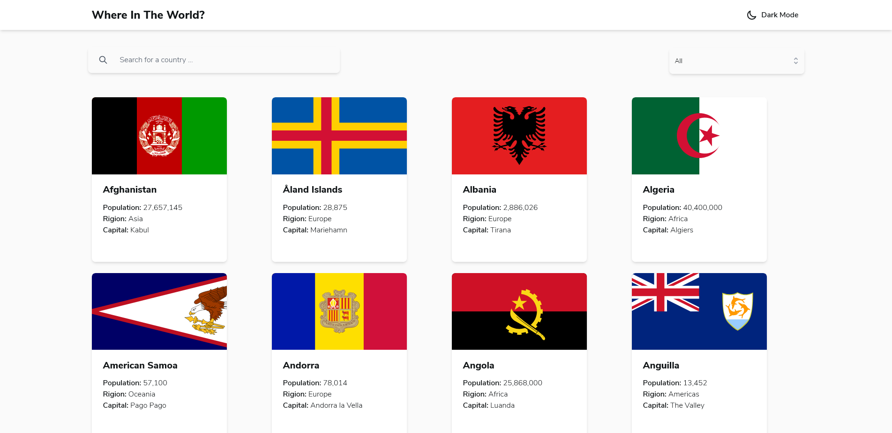
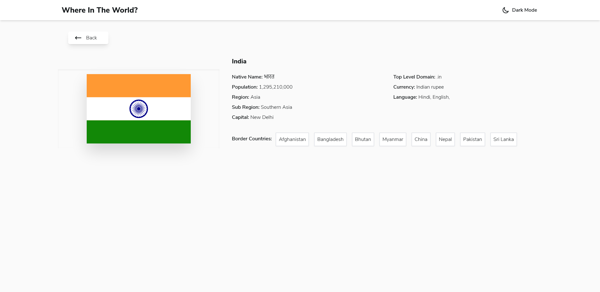
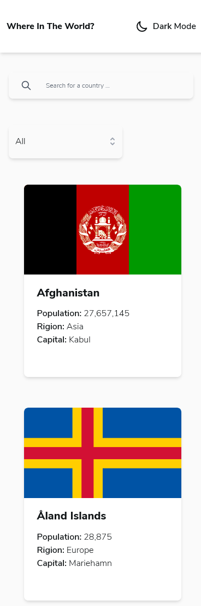
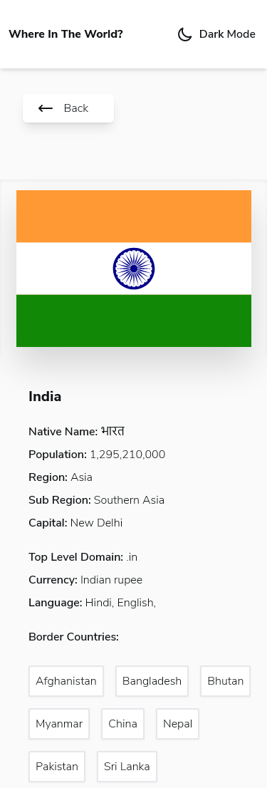

# Frontend Mentor - REST Countries API with color theme switcher solution

This is a solution to the [REST Countries API with color theme switcher challenge on Frontend Mentor](https://www.frontendmentor.io/challenges/rest-countries-api-with-color-theme-switcher-5cacc469fec04111f7b848ca). Frontend Mentor challenges help you improve your coding skills by building realistic projects. 

## Table of contents

- [Overview](#overview)
  - [The challenge](#the-challenge)
  - [Screenshot](#screenshot)
  - [Links](#links)
- [My process](#my-process)
  - [Built with](#built-with)
  - [What I learned](#what-i-learned)
  - [Continued development](#continued-development)
  - [Useful resources](#useful-resources)
- [Author](#author)
- [Acknowledgments](#acknowledgments)

## Overview

### The challenge

Users should be able to:

- See all countries from the API on the homepage
- Search for a country using an `input` field
- Filter countries by region
- Click on a country to see more detailed information on a separate page
- Click through to the border countries on the detail page
- Toggle the color scheme between light and dark mode *(optional)*

### Screenshot

### Links

- Solution URL: [https://www.frontendmentor.io/solutions/rest-countries-api-with-color-theme-switcher-solution-nextjstailwind-YYmSLrOeN](https://www.frontendmentor.io/solutions/rest-countries-api-with-color-theme-switcher-solution-nextjstailwind-YYmSLrOeN)
- Live Site URL: [https://countries-details-next-tailwind-jamstack.vercel.app/](https://countries-details-next-tailwind-jamstack.vercel.app/)

### Built with

- Semantic HTML5 markup
- SCSS custom properties
- Flexbox
- CSS Grid
- Mobile-first workflow
- [React](https://reactjs.org/) - JS library
- [Next.js](https://nextjs.org/) - React framework
- [Tailwind Css](https://tailwindcss.com/) - For styles

## Author

- Website - [HR Developers(Ranjeet)](https://modest-jones-78fd0c.netlify.app/)
- Frontend Mentor - [@its-me-rcode](https://www.frontendmentor.io/profile/its-me-rcode)
- Twitter - [@its_me_ranjeeth](https://www.twitter.com/@its_me_ranjeeth)

